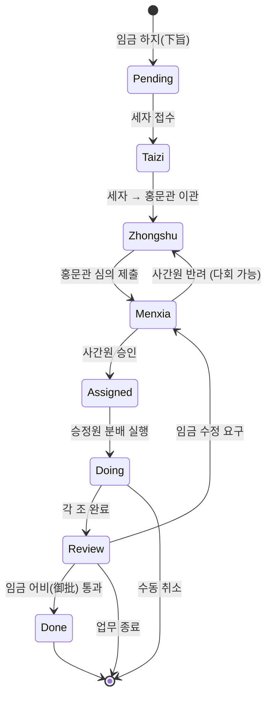

# 3사6조 임무 분배·유전(流轉) 체계 · 업무 및 기술 아키텍처

> 본 문서는 「3사6조」 프로젝트가 **업무 제도 설계**에서 **코드 구현 세부사항**까지 어떻게 복잡한 멀티 Agent 협업의 임무 분배와 흐름을 완전하게 처리하는지 상세히 서술합니다. 이는 전통적인 자유 토론식 협업 시스템이 아니라 **제도화된 AI 멀티 Agent 프레임워크**입니다.

**문서 개요도**

```
━━━━━━━━━━━━━━━━━━━━━━━━━━━━━━━━━━━━━━━━━━━━━━━━━━━━━━━━━━━━━
업무층: 왕국 제도 (Imperial Governance Model)
  ├─ 분권 견제: 임금 → 세자 → 홍문관 → 사간원 → 승정원 → 6조
  ├─ 제도 제약: 월권 불가, 상태 엄격 진행, 사간원 필심의
  └─ 품질 보장: 반려·재작업 가능, 실시간 관측, 긴급 개입 가능
━━━━━━━━━━━━━━━━━━━━━━━━━━━━━━━━━━━━━━━━━━━━━━━━━━━━━━━━━━━━━
기술층: OpenClaw 멀티 Agent 오케스트레이션 (Multi-Agent Orchestration)
  ├─ 상태 머신: 9개 상태 (Pending → Taizi → Zhongshu → Menxia → Assigned → Doing/Next → Review → Done/Cancelled)
  ├─ 데이터 융합: flow_log + progress_log + session JSONL → unified activity stream
  ├─ 권한 매트릭스: 엄격한 subagent 호출 권한 제어
  └─ 스케줄링층: 자동 분배, 타임아웃 재시도, 정체 에스컬레이션, 자동 롤백
━━━━━━━━━━━━━━━━━━━━━━━━━━━━━━━━━━━━━━━━━━━━━━━━━━━━━━━━━━━━━
관측층: React 칸반 + 실시간 API (Dashboard + Real-time Analytics)
  ├─ 임무 칸반: 10개 뷰 패널 (전체/상태별/부서별/우선순위별 등)
  ├─ 활동 스트림: 임무당 59건의 혼합 활동 기록 (사고 과정, 도구 호출, 상태 전이)
  └─ 온라인 상태: Agent 실시간 노드 감지 + 하트비트 깨움 메커니즘
━━━━━━━━━━━━━━━━━━━━━━━━━━━━━━━━━━━━━━━━━━━━━━━━━━━━━━━━━━━━━
```

---

## 📚 제1부: 업무 아키텍처

### 1.1 왕국 제도: 분권 견제의 설계 철학

#### 핵심 이념

전통적인 멀티 Agent 프레임워크(CrewAI, AutoGen 등)는 **"자유 협업" 모델**을 채택합니다:
- Agent가 자율적으로 협업 대상을 선택
- 프레임워크는 통신 채널만 제공
- 품질 통제는 전적으로 Agent의 지능에 의존
- **문제점**: Agent가 서로 가짜 데이터를 만들거나, 작업이 중복되거나, 방안 품질이 보장되지 않기 쉬움

**3사6조**는 고대 왕국의 관료 체계를 모방한 **"제도화 협업" 모델**을 채택합니다:

```
              임금
              (User)
               │
               ↓
             세자 (Taizi)
        [분류관, 메시지 접수 총책임]
      ├─ 식별: 이것이 지시인가 잡담인가?
      ├─ 실행: 잡담은 직접 회신 || 임무 생성 → 홍문관으로 이관
      └─ 권한: 홍문관만 호출 가능
               │
               ↓
           홍문관 (Zhongshu)
      [기획관, 방안 기초 총책임]
      ├─ 지시 접수 후 요구사항 분석
      ├─ 하위 임무(todos)로 분해
      ├─ 사간원 심의 호출 OR 승정원 자문
      └─ 권한: 사간원 + 승정원만 호출 가능
               │
               ↓
           사간원 (Menxia)
        [심의관, 품질 관리자]
      ├─ 홍문관 방안 심사 (실현 가능성, 완전성, 위험)
      ├─ 승인 OR 반려 (수정 의견 포함)
      ├─ 반려 시 → 홍문관으로 반환 → 재심의 (최대 3회)
      └─ 권한: 승정원 + 홍문관 콜백만 호출 가능
               │
         (✅ 승인)
               │
               ↓
           승정원 (Shangshu)
        [분배관, 실행 총지휘]
      ├─ 승인된 방안 접수
      ├─ 어느 부서로 분배할지 분석
      ├─ 6조(예/호/병/형/공/이) 호출하여 실행
      ├─ 각 조 진행 상황 모니터링 → 결과 종합
      └─ 권한: 6조만 호출 가능 (월권으로 홍문관 호출 불가)
               │
               ├─ 예조 (Libu)      - 문서 작성관
               ├─ 호조 (Hubu)      - 데이터 분석관
               ├─ 병조 (Bingbu)    - 코드 구현관
               ├─ 형조 (Xingbu)    - 테스트 심사관
               ├─ 공조 (Gongbu)    - 인프라 관리관
               └─ 이조 (Libu_hr)   - 인사 관리관
               │
         (각 조 병렬 실행)
               ↓
           승정원·종합
      ├─ 6조 결과 수집
      ├─ 상태를 Review 로 전환
      ├─ 홍문관 콜백하여 임금에게 전보(轉報)
               │
               ↓
           홍문관·회보
      ├─ 현상, 결론, 건의 종합
      ├─ 상태를 Done 으로 전환
      └─ Feishu(飞书) 메시지로 임금에게 회신
```

#### 제도의 4대 보장

| 보장 메커니즘 | 구현 세부사항 | 보호 효과 |
|---------|---------|---------|
| **제도적 심사** | 사간원이 모든 홍문관 방안을 반드시 심의, 건너뛰기 불가 | Agent의 임의 실행 방지, 방안의 실현 가능성 보장 |
| **분권 견제** | 권한 매트릭스: 누가 누구를 호출할 수 있는지 엄격히 정의 | 권한 남용 방지 (예: 승정원이 월권으로 홍문관 방안 수정) |
| **완전한 관측 가능성** | 임무 칸반 10개 패널 + 임무당 59건 활동 | 임무가 어디에서 막혔는지, 누가 일하는지, 작업 상태가 어떤지 실시간 확인 |
| **실시간 개입 가능성** | 칸반 내 stop/cancel/resume/advance 원클릭 | 긴급 상황 (예: Agent가 잘못된 방향으로 갈 때) 즉시 시정 가능 |

---

### 1.2 임무 전체 흐름 프로세스

#### 흐름 도식도



#### 구체적 핵심 경로

**✅ 이상적 경로**(정체 없음, 4-5일 완료)

```
DAY 1:
  10:00 - 임금 Feishu(飞书): "3사6조용 완전 자동화 테스트 방안 작성"
          세자 지시 접수. state = Taizi, org = 세자
          taizi agent 자동 분배 → 이 지시 처리
  
  10:30 - 세자 분류 완료. "업무 지시"로 판정 (잡담 아님)
          임무 생성 JJC-20260228-E2E
          flow_log 기록: "임금 → 세자: 하지(下旨)"
          state: Taizi → Zhongshu, org: 세자 → 홍문관
          zhongshu agent 자동 분배

DAY 2:
  09:00 - 홍문관 지시 접수. 기획 시작
          진행 보고: "테스트 요구사항 분석, 단위/통합/E2E 3계층으로 분해"
          progress_log 기록: "홍문관 김삼: 요구사항 분석"
          
  15:00 - 홍문관 방안 완성
          todos 스냅샷: 요구사항 분석✅, 방안 설계✅, 심의 대기🔄
          flow_log 기록: "홍문관 → 사간원: 방안 심의 제출"
          state: Zhongshu → Menxia, org: 홍문관 → 사간원
          menxia agent 자동 분배

DAY 3:
  09:00 - 사간원 심의 시작
          진행 보고: "방안의 완전성과 위험을 심사 중"
          
  14:00 - 사간원 심의 완료
          판정: "방안 실현 가능, 다만 _infer_agent_id_from_runtime 함수의 테스트 누락"
          행위: ✅ 승인 (수정 의견 포함)
          flow_log 기록: "사간원 → 승정원: ✅ 승인 통과 (5건 건의)"
          state: Menxia → Assigned, org: 사간원 → 승정원
          OPTIONAL: 홍문관이 건의를 받고 능동적으로 방안 최적화
          shangshu agent 자동 분배

DAY 4:
  10:00 - 승정원 승인 접수
          분석: "이 테스트 방안은 공조+형조+예조가 협력하여 완수해야 함"
          flow_log 기록: "승정원 → 6조: 분배 실행 (병형 협력)"
          state: Assigned → Doing, org: 승정원 → 병조+형조+예조
          bingbu/xingbu/libu 3개 agent 자동 분배 (병렬)

DAY 4-5:
  (각 조 병렬 실행)
  - 병조(bingbu): pytest + unittest 테스트 프레임워크 구현
  - 형조(xingbu): 모든 핵심 함수 커버리지 테스트 작성
  - 예조(libu): 테스트 문서 및 사용 사례 설명 정리
  
  실시간 보고 (hourly progress):
  - 병조: "✅ 단위 테스트 16개 구현 완료"
  - 형조: "🔄 통합 테스트 작성 중 (8/12 완료)"
  - 예조: "병조 완료 대기 후 보고서 작성"

DAY 5:
  14:00 - 각 조 완료
          state: Doing → Review, org: 병조 → 승정원
          승정원 종합: "모든 테스트 완료, 통과율 98.5%"
          홍문관으로 회송
          
  15:00 - 홍문관 임금에게 회보
          state: Review → Done
          Feishu(飞书)로 템플릿 회신, 최종 성과 링크와 요약 포함
```

**❌ 좌절 경로**(반려 및 재시도 포함, 6-7일)

```
DAY 2 동일

DAY 3 [반려 시나리오]:
  14:00 - 사간원 심의 완료
          판정: "방안 불완전, 성능 테스트 + 부하 테스트 누락"
          행위: 🚫 반려
          review_round += 1
          flow_log 기록: "사간원 → 홍문관: 🚫 반려 (성능 테스트 보강 필요)"
          state: Menxia → Zhongshu  # 홍문관으로 반환하여 수정
          zhongshu agent 자동 분배 (재기획)

DAY 3-4:
  16:00 - 홍문관 반려 통지 접수 (agent 깨움)
          개선 의견 분석, 성능 테스트 방안 보강
          progress: "성능 테스트 요구사항 통합 완료, 수정 방안은 다음과 같음..."
          flow_log 기록: "홍문관 → 사간원: 수정 방안 (제2차 심의)"
          state: Zhongshu → Menxia
          menxia agent 자동 분배

  18:00 - 사간원 재심의
          판정: "✅ 이번에 통과"
          flow_log 기록: "사간원 → 승정원: ✅ 승인 통과 (제2차)"
          state: Menxia → Assigned → Doing
          이후는 이상적 경로와 동일...

DAY 7: 전체 완료 (이상적 경로보다 1-2일 늦음)
```

---

### 1.3 임무 명세서와 업무 계약

#### Task Schema 필드 설명

```json
{
  "id": "JJC-20260228-E2E",          // 임무 전역 고유 ID (JJC-날짜-순번)
  "title": "3사6조용 완전 자동화 테스트 방안 작성",
  "official": "홍문관제학",          // 담당 관직
  "org": "홍문관",                   // 현재 담당 부서
  "state": "Assigned",               // 현재 상태 (_STATE_FLOW 참조)
  
  // ──── 품질 및 제약 ────
  "priority": "normal",              // 우선순위: critical/high/normal/low
  "block": "없음",                   // 현재 정체 사유 (예: "공조 피드백 대기")
  "reviewRound": 2,                  // 사간원 심의 회차
  "_prev_state": "Menxia",           // stop 된 경우 resume 용 이전 상태 기록
  
  // ──── 업무 산출물 ────
  "output": "",                      // 최종 임무 성과 (URL/파일 경로/요약)
  "ac": "",                          // Acceptance Criteria (검수 기준)
  "priority": "normal",
  
  // ──── 흐름 기록 ────
  "flow_log": [
    {
      "at": "2026-02-28T10:00:00Z",
      "from": "임금",
      "to": "세자",
      "remark": "하지(下旨): 3사6조용 완전 자동화 테스트 방안 작성"
    },
    {
      "at": "2026-02-28T10:30:00Z",
      "from": "세자",
      "to": "홍문관",
      "remark": "분류 → 전지(傳旨)"
    },
    {
      "at": "2026-02-28T15:00:00Z",
      "from": "홍문관",
      "to": "사간원",
      "remark": "기획 방안 심의 제출"
    },
    {
      "at": "2026-03-01T09:00:00Z",
      "from": "사간원",
      "to": "홍문관",
      "remark": "🚫 반려: 성능 테스트 보강 필요"
    },
    {
      "at": "2026-03-01T15:00:00Z",
      "from": "홍문관",
      "to": "사간원",
      "remark": "수정 방안 (제2차 심의)"
    },
    {
      "at": "2026-03-01T20:00:00Z",
      "from": "사간원",
      "to": "승정원",
      "remark": "✅ 승인 통과 (제2차, 5건 건의 채택)"
    }
  ],
  
  // ──── Agent 실시간 보고 ────
  "progress_log": [
    {
      "at": "2026-02-28T10:35:00Z",
      "agent": "zhongshu",              // 보고 agent
      "agentLabel": "홍문관",
      "text": "지시 접수 완료. 테스트 요구사항 분석, 3계층 테스트 방안 입안 중...",
      "state": "Zhongshu",              // 보고 시점 상태 스냅샷
      "org": "홍문관",
      "tokens": 4500,                   // 자원 소비
      "cost": 0.0045,
      "elapsed": 120,
      "todos": [                        // 할 일 임무 스냅샷
        {"id": "1", "title": "요구사항 분석", "status": "completed"},
        {"id": "2", "title": "방안 설계", "status": "in-progress"},
        {"id": "3", "title": "심의 대기", "status": "not-started"}
      ]
    },
    // ... 추가 progress_log 항목 ...
  ],
  
  // ──── 스케줄링 메타데이터 ────
  "_scheduler": {
    "enabled": true,
    "stallThresholdSec": 180,         // 180초 이상 정체 시 자동 에스컬레이션
    "maxRetry": 1,                    // 자동 재시도 최대 1회
    "retryCount": 0,
    "escalationLevel": 0,             // 0=에스컬레이션 없음 1=사간원 조정 2=승정원 조정
    "lastProgressAt": "2026-03-01T20:00:00Z",
    "stallSince": null,               // 정체 시작 시각
    "lastDispatchStatus": "success",  // queued|success|failed|timeout|error
    "snapshot": {
      "state": "Assigned",
      "org": "승정원",
      "note": "review-before-approve"
    }
  },
  
  // ──── 생명 주기 ────
  "archived": false,                 // 아카이브 여부
  "now": "사간원 승인, 승정원으로 이관하여 분배",  // 현재 실시간 상태 설명
  "updatedAt": "2026-03-01T20:00:00Z"
}
```

#### 업무 계약

| 계약 | 의미 | 위반 결과 |
|------|------|---------|
| **월권 불가** | 세자는 홍문관만, 홍문관은 사간원/승정원만, 6조는 외부 호출 불가 | 권한 초과 호출 거부, 시스템 자동 차단 |
| **상태 단방향 진행** | Pending → Taizi → Zhongshu → ... → Done, 건너뛰기나 역행 불가 | review_action(reject) 를 통해서만 이전 단계로 회귀 |
| **사간원 필심의** | 홍문관이 제출한 모든 방안은 사간원 심의 필수, 건너뛰기 불가 | 홍문관이 직접 승정원으로 이관 불가, 사간원을 반드시 거쳐야 함 |
| **Done 후 변경 불가** | 임무가 Done/Cancelled 진입 후 상태 수정 불가 | 수정 필요 시 새 임무를 생성하거나 취소 후 재생성 |
| **task_id 고유성** | JJC-날짜-순번이 전역 고유, 같은 날 같은 임무 중복 생성 불가 | 칸반에서 중복 방지, 자동 중복 제거 |
| **자원 소비 투명** | 각 진행 보고마다 tokens/cost/elapsed 보고 필수 | 비용 정산과 성능 최적화에 유용 |

---

## 🔧 제2부: 기술 아키텍처

### 2.1 상태 머신과 자동 분배

#### 상태 전이 완전 정의

```python
_STATE_FLOW = {
    'Pending':  ('Taizi',   '임금',    '세자',    '미처리 지시를 세자로 이관하여 분류'),
    'Taizi':    ('Zhongshu','세자',    '홍문관',  '세자 분류 완료, 홍문관으로 이관하여 기초'),
    'Zhongshu': ('Menxia',  '홍문관',  '사간원',  '홍문관 방안을 사간원으로 심의 제출'),
    'Menxia':   ('Assigned','사간원',  '승정원',  '사간원 승인, 승정원으로 이관하여 분배'),
    'Assigned': ('Doing',   '승정원',  '6조',    '승정원 분배 실행 시작'),
    'Next':     ('Doing',   '승정원',  '6조',    '실행 대기 임무 실행 시작'),
    'Doing':    ('Review',  '6조',    '승정원',  '각 조 완료, 종합 단계 진입'),
    'Review':   ('Done',    '승정원',  '세자',    '전 과정 완료, 세자에게 회보하여 임금에게 전보'),
}
```

각 상태는 자동으로 Agent ID 와 연관됩니다(`_STATE_AGENT_MAP` 참조):

```python
_STATE_AGENT_MAP = {
    'Taizi':    'taizi',
    'Zhongshu': 'zhongshu',
    'Menxia':   'menxia',
    'Assigned': 'shangshu',
    'Doing':    None,      # org 에서 추론 (6조 중 하나)
    'Next':     None,      # org 에서 추론
    'Review':   'shangshu',
    'Pending':  'zhongshu',
}
```

#### 자동 분배 흐름

임무 상태가 전이될 때(`handle_advance_state()` 또는 심의를 통해), 백그라운드에서 자동으로 분배가 실행됩니다:

```
1. 상태 전이가 분배를 트리거
   ├─ _STATE_AGENT_MAP 조회로 대상 agent_id 획득
   ├─ Doing/Next 인 경우 task.org 에서 _ORG_AGENT_MAP 조회로 구체적 부서 agent 추론
   └─ 추론 불가 시 분배 건너뜀 (예: Done/Cancelled)

2. 분배 메시지 구성 (Agent 의 즉각적 작업 유도용)
   ├─ taizi: "📜 임금의 지시를 처리해 주십시오..."
   ├─ zhongshu: "📜 지시가 홍문관에 도달했습니다, 방안을 기초해 주십시오..."
   ├─ menxia: "📋 홍문관 방안 심의 제출..."
   ├─ shangshu: "📮 사간원 승인, 분배 실행해 주십시오..."
   └─ 6조: "📌 임무를 처리해 주십시오..."

3. 백그라운드 비동기 분배 (논블로킹)
   ├─ daemon thread spawn
   ├─ _scheduler.lastDispatchStatus = 'queued' 표시
   ├─ Gateway 프로세스 가동 여부 확인
   ├─ openclaw agent --agent {id} -m "{msg}" --deliver --timeout 300 실행
   ├─ 최대 2회 재시도 (실패 간격 5초 백오프)
   ├─ _scheduler 상태 및 오류 정보 갱신
   └─ flow_log 에 분배 결과 기록

4. 분배 상태 전이
   ├─ success: _scheduler.lastDispatchStatus = 'success' 즉시 갱신
   ├─ failed: 실패 사유 기록, Agent 타임아웃이 칸반을 block 하지 않음
   ├─ timeout: timeout 표시, 사용자가 수동 재시도/에스컬레이션 가능
   ├─ gateway-offline: Gateway 미가동, 이번 분배 건너뜀 (이후 재시도 가능)
   └─ error: 예외 상황, 디버깅용 스택 기록

5. 대상 Agent 도달 시 처리
   ├─ Agent 가 Feishu(飞书) 메시지로 통지 수신
   ├─ kanban_update.py 를 통해 칸반과 상호작용 (상태 갱신/진행 기록)
   └─ 작업 완료 후 다음 Agent 분배 재트리거
```

---

### 2.2 권한 매트릭스와 Subagent 호출

#### 권한 정의 (openclaw.json 에서 구성)

```json
{
  "agents": [
    {
      "id": "taizi",
      "label": "세자",
      "allowAgents": ["zhongshu"]
    },
    {
      "id": "zhongshu",
      "label": "홍문관",
      "allowAgents": ["menxia", "shangshu"]
    },
    {
      "id": "menxia",
      "label": "사간원",
      "allowAgents": ["shangshu", "zhongshu"]
    },
    {
      "id": "shangshu",
      "label": "승정원",
      "allowAgents": ["libu", "hubu", "bingbu", "xingbu", "gongbu", "libu_hr"]
    },
    {
      "id": "libu",
      "label": "예조",
      "allowAgents": []
    },
    // ... 다른 6조도 동일하게 allowAgents = [] ...
  ]
}
```

#### 권한 검사 메커니즘 (코드 레벨)

`dispatch_for_state()` 외에도 방어적 권한 검사 로직이 있습니다:

```python
def can_dispatch_to(from_agent, to_agent):
    """from_agent 가 to_agent 를 호출할 권한이 있는지 검사."""
    cfg = read_json(DATA / 'agent_config.json', {})
    agents = cfg.get('agents', [])
    
    from_record = next((a for a in agents if a.get('id') == from_agent), None)
    if not from_record:
        return False, f'{from_agent} 존재하지 않음'
    
    allowed = from_record.get('allowAgents', [])
    if to_agent not in allowed:
        return False, f'{from_agent} 는 {to_agent} 호출 권한 없음 (허용 목록: {allowed})'
    
    return True, 'OK'
```

#### 권한 위반 사례와 처리

| 시나리오 | 요청 | 결과 | 사유 |
|------|------|------|------|
| **정상** | 홍문관 → 사간원 심의 | ✅ 허용 | 사간원이 홍문관의 allowAgents 에 있음 |
| **위반** | 홍문관 → 승정원 방안 수정 | ❌ 거부 | 홍문관은 사간원/승정원만 호출 가능, 승정원 작업을 수동 수정 불가 |
| **위반** | 공조 → 승정원 "완료했습니다" | ✅ 상태 변경 | flow_log 와 progress_log 를 통해서 (cross-Agent 호출 아님) |
| **위반** | 승정원 → 홍문관 "방안 재수정" | ❌ 거부 | 승정원은 사간원/홍문관의 allowAgents 에 없음 |
| **방어** | Agent 가 다른 agent 분배 위조 | ❌ 차단 | API 계층에서 HTTP 요청 출처/서명 검증 |

---

### 2.3 데이터 융합: progress_log + session JSONL

#### 현상

임무 실행 시 3계층의 데이터 소스가 있습니다:

```
1️⃣ flow_log
   └─ 순수하게 상태 전이만 기록 (Zhongshu → Menxia)
   └─ 데이터 소스: 임무 JSON 의 flow_log 필드
   └─ 출처: Agent 가 kanban_update.py flow 명령으로 보고

2️⃣ progress_log
   └─ Agent 의 실시간 작업 보고 (텍스트 진행, todos 스냅샷, 자원 소비)
   └─ 데이터 소스: 임무 JSON 의 progress_log 필드
   └─ 출처: Agent 가 kanban_update.py progress 명령으로 보고
   └─ 주기: 보통 30분마다 또는 핵심 노드에서 1회 보고

3️⃣ session JSONL (신규!)
   └─ Agent 의 내부 사고 과정(thinking), 도구 호출(tool_result), 대화 이력(user)
   └─ 데이터 소스: ~/.openclaw/agents/{agent_id}/sessions/*.jsonl
   └─ 출처: OpenClaw 프레임워크가 자동 기록, Agent 능동 조작 불필요
   └─ 주기: 메시지 레벨, 가장 미세한 입자도
```

#### 문제 진단

과거에는 flow_log + progress_log 만으로 진행을 표현했습니다:
- ❌ Agent 의 구체적 사고 과정을 볼 수 없음
- ❌ 매 도구 호출의 결과를 볼 수 없음
- ❌ Agent 의 중간 대화 이력을 볼 수 없음
- ❌ Agent 가 "블랙박스 상태" 를 보임

예: progress_log 에 "요구사항 분석 중" 으로 기록되지만, 사용자는 도대체 무엇을 분석했는지 알 수 없음.

#### 해결 방안: Session JSONL 융합

`get_task_activity()` 에 융합 로직 추가 (40줄):

```python
def get_task_activity(task_id):
    # ... 앞 코드 동일 ...
    
    # ── Agent Session 활동 융합 (thinking / tool_result / user) ──
    session_entries = []
    
    # 활성 임무: task_id 정확 매칭 시도
    if state not in ('Done', 'Cancelled'):
        if agent_id:
            entries = get_agent_activity(
                agent_id, limit=30, task_id=task_id
            )
            session_entries.extend(entries)
        
        # 관련 Agent 에서도 가져오기
        for ra in related_agents:
            if ra != agent_id:
                entries = get_agent_activity(
                    ra, limit=20, task_id=task_id
                )
                session_entries.extend(entries)
    else:
        # 완료된 임무: 키워드 매칭 기반
        title = task.get('title', '')
        keywords = _extract_keywords(title)
        if keywords:
            for ra in related_agents[:5]:
                entries = get_agent_activity_by_keywords(
                    ra, keywords, limit=15
                )
                session_entries.extend(entries)
    
    # 중복 제거 (at+kind 로 중복 방지)
    existing_keys = {(a.get('at', ''), a.get('kind', '')) for a in activity}
    for se in session_entries:
        key = (se.get('at', ''), se.get('kind', ''))
        if key not in existing_keys:
            activity.append(se)
            existing_keys.add(key)
    
    # 재정렬
    activity.sort(key=lambda x: x.get('at', ''))
    
    # 반환 시 데이터 출처 표시
    return {
        'activity': activity,
        'activitySource': 'progress+session',  # 신규 표시
        # ... 기타 필드 ...
    }
```

#### Session JSONL 형식 파싱

JSONL 에서 추출한 항목은 통일된 칸반 활동 항목으로 변환됩니다:

```python
def _parse_activity_entry(item):
    """session jsonl 의 message 를 통일된 칸반 활동 항목으로 파싱."""
    msg = item.get('message', {})
    role = str(msg.get('role', '')).strip().lower()
    ts = item.get('timestamp', '')
    
    # 🧠 Assistant 역할 - Agent 사고 과정
    if role == 'assistant':
        entry = {
            'at': ts,
            'kind': 'assistant',
            'text': '...메인 응답...',
            'thinking': '💭 Agent 가 고려한 내용...',  # 내부 사고 체인
            'tools': [
                {'name': 'bash', 'input_preview': 'cd /src && npm test'},
                {'name': 'file_read', 'input_preview': 'dashboard/server.py'},
            ]
        }
        return entry
    
    # 🔧 Tool Result - 도구 호출 결과
    if role in ('toolresult', 'tool_result'):
        entry = {
            'at': ts,
            'kind': 'tool_result',
            'tool': 'bash',
            'exitCode': 0,
            'output': '✓ All tests passed (123 tests)',
            'durationMs': 4500  # 실행 시간
        }
        return entry
    
    # 👤 User - 인공 피드백 또는 대화
    if role == 'user':
        entry = {
            'at': ts,
            'kind': 'user',
            'text': '테스트 케이스의 예외 처리를 구현해 주세요'
        }
        return entry
```

#### 융합 후의 활동 스트림 구조

단일 임무의 59건 활동 스트림 (JJC-20260228-E2E 예):

```
kind        count  대표 이벤트
────────────────────────────────────────────────
flow         10    상태 전이 체인 (Pending→Taizi→Zhongshu→...)
progress     11    Agent 작업 보고 ("분석 중", "완료")
todos        11    할 일 임무 스냅샷 (진행 갱신 시마다)
user          1    사용자 피드백 (예: "성능 테스트 보강 필요")
assistant    10    Agent 사고 과정 (💭 reasoning chain)
tool_result  16    도구 호출 기록 (bash 실행 결과, API 호출 결과)
────────────────────────────────────────────────
총계         59    완전한 작업 궤적
```

칸반 표시 시 사용자는 다음을 볼 수 있습니다:
- 📋 흐름 체인을 보고 임무가 어느 단계에 있는지 파악
- 📝 progress 를 보고 Agent 가 실시간으로 무엇을 말하는지 파악
- ✅ todos 를 보고 임무 분해와 완료 진행 상황 파악
- 💭 assistant/thinking 을 보고 Agent 의 사고 과정 파악
- 🔧 tool_result 를 보고 매 도구 호출의 결과 파악
- 👤 user 를 보고 인공 개입 여부 파악

---

### 2.4 스케줄링 시스템: 타임아웃 재시도, 정체 에스컬레이션, 자동 롤백

#### 스케줄링 메타데이터 구조

```python
_scheduler = {
    # 구성 파라미터
    'enabled': True,
    'stallThresholdSec': 180,         # 정체 후 자동 에스컬레이션 임계값 (기본 180초)
    'maxRetry': 1,                    # 자동 재시도 횟수 (0=재시도 없음, 1=1회 재시도)
    'autoRollback': True,             # 스냅샷으로 자동 롤백 여부
    
    # 런타임 상태
    'retryCount': 0,                  # 현재 재시도 횟수
    'escalationLevel': 0,             # 0=에스컬레이션 없음 1=사간원 조정 2=승정원 조정
    'stallSince': None,               # 정체 시작 타임스탬프
    'lastProgressAt': '2026-03-01T...',  # 마지막 진행 획득 시각
    'lastEscalatedAt': '2026-03-01T...',
    'lastRetryAt': '2026-03-01T...',
    
    # 분배 추적
    'lastDispatchStatus': 'success',  # queued|success|failed|timeout|gateway-offline|error
    'lastDispatchAgent': 'zhongshu',
    'lastDispatchTrigger': 'state-transition',
    'lastDispatchError': '',          # 오류 스택 (있는 경우)
    
    # 스냅샷 (자동 롤백용)
    'snapshot': {
        'state': 'Assigned',
        'org': '승정원',
        'now': '분배 대기...',
        'savedAt': '2026-03-01T...',
        'note': 'scheduled-check'
    }
}
```

#### 스케줄링 알고리즘

60초마다 1회 `handle_scheduler_scan(threshold_sec=180)` 실행:

```
FOR EACH 임무:
  IF state in (Done, Cancelled, Blocked):
    SKIP  # 종료 상태는 처리 안 함
  
  elapsed_since_progress = NOW - lastProgressAt
  
  IF elapsed_since_progress < stallThreshold:
    SKIP  # 최근 진행 있음, 처리 불필요
  
  # ── 정체 처리 로직 ──
  IF retryCount < maxRetry:
    ✅ 【재시도】 실행
    - retryCount 증가
    - dispatch_for_state(task, new_state, trigger='taizi-scan-retry')
    - flow_log: "180초 정체, 자동 재시도 제N회 트리거"
    - NEXT task
  
  IF escalationLevel < 2:
    ✅ 【에스컬레이션】 실행
    - nextLevel = escalationLevel + 1
    - target_agent = menxia (L=1) else shangshu (L=2)
    - wake_agent(target_agent, "💬 임무 정체, 개입하여 추진해 주세요")
    - flow_log: "{target_agent} 로 에스컬레이션하여 조정"
    - NEXT task
  
  IF escalationLevel >= 2 AND autoRollback:
    ✅ 【자동 롤백】 실행
    - task 를 snapshot.state 로 복원
    - retryCount = 0
    - escalationLevel = 0
    - dispatch_for_state(task, snapshot.state, trigger='taiji-auto-rollback')
    - flow_log: "연속 정체, {snapshot.state} 로 자동 롤백"
```

#### 예시 시나리오

**시나리오: 홍문관 Agent 프로세스 충돌, 임무가 Zhongshu 에서 정체**

```
T+0:
  홍문관이 방안 기획 중
  lastProgressAt = T
  dispatch status = success

T+30:
  Agent 프로세스 의외 충돌 (또는 과부하 무응답)
  lastProgressAt 여전히 = T (새 progress 없음)

T+60:
  scheduler_scan 1회 스캔, 발견:
  elapsed = 60 < 180, 건너뜀

T+180:
  scheduler_scan 1회 스캔, 발견:
  elapsed = 180 >= 180, 처리 트리거
  
  ✅ 단계1: 재시도
  - retryCount: 0 → 1
  - dispatch_for_state('JJC-20260228-E2E', 'Zhongshu', trigger='taizi-scan-retry')
  - 분배 메시지를 홍문관으로 발송 (agent 깨우거나 재시작)
  - flow_log: "180초 정체, 자동 재시도 제1회"

T+240:
  홍문관 Agent 복구 (또는 수동 재시작), 재시도 분배 수신
  진행 보고: "복구 완료, 기획 계속..."
  lastProgressAt 이 T+240 으로 갱신
  retryCount 가 0 으로 리셋
  
  ✓ 문제 해결

T+360 (여전히 미복구 시):
  scheduler_scan 재스캔, 발견:
  elapsed = 360 >= 180, retryCount 이미 = 1
  
  ✅ 단계2: 에스컬레이션
  - escalationLevel: 0 → 1
  - wake_agent('menxia', "💬 임무 JJC-20260228-E2E 정체, 홍문관 무응답, 개입해 주세요")
  - flow_log: "사간원으로 에스컬레이션하여 조정"
  
  사간원 Agent 가 깨워짐, 가능한 동작:
  - 홍문관 온라인 여부 확인
  - 온라인이면 진행 문의
  - 오프라인이면 응급 프로세스 시작 가능 (예: 사간원이 임시로 기초 대행)

T+540 (여전히 미해결 시):
  scheduler_scan 재스캔, 발견:
  escalationLevel = 1, 아직 2까지 에스컬레이션 가능
  
  ✅ 단계3: 재차 에스컬레이션
  - escalationLevel: 1 → 2
  - wake_agent('shangshu', "💬 임무 장기 정체, 홍문관+사간원 모두 추진 불가, 승정원이 개입 조정해 주세요")
  - flow_log: "승정원으로 에스컬레이션하여 조정"

T+720 (여전히 미해결 시):
  scheduler_scan 재스캔, 발견:
  escalationLevel = 2 (최대), autoRollback = true
  
  ✅ 단계4: 자동 롤백
  - snapshot.state = 'Assigned' (이전 안정 상태)
  - task.state: Zhongshu → Assigned
  - dispatch_for_state('JJC-20260228-E2E', 'Assigned', trigger='taizi-auto-rollback')
  - flow_log: "연속 정체, Assigned 로 자동 롤백, 승정원이 재분배"
  
  결과:
  - 승정원이 6조에 재분배하여 실행
  - 홍문관의 방안은 이전 snapshot 버전에 보존
  - 사용자는 롤백 동작을 보고 개입 여부 결정 가능
```

---

## 🎯 제3부: 핵심 API 와 CLI 도구

### 3.1 임무 조작 API 엔드포인트

#### 임무 생성: `POST /api/create-task`

```
요청:
{
  "title": "3사6조용 완전 자동화 테스트 방안 작성",
  "org": "홍문관",           // 선택, 기본값 세자
  "official": "홍문관제학",  // 선택
  "priority": "normal",
  "template_id": "test_plan", // 선택
  "params": {},
  "target_dept": "병조+형조"  // 선택, 분배 권고
}

응답:
{
  "ok": true,
  "taskId": "JJC-20260228-001",
  "message": "지시 JJC-20260228-001 하달됨, 세자에게 분배 중"
}
```

#### 임무 활동 스트림: `GET /api/task-activity/{task_id}`

```
요청:
GET /api/task-activity/JJC-20260228-E2E

응답:
{
  "ok": true,
  "taskId": "JJC-20260228-E2E",
  "taskMeta": {
    "title": "3사6조용 완전 자동화 테스트 방안 작성",
    "state": "Assigned",
    "org": "승정원",
    "output": "",
    "block": "없음",
    "priority": "normal"
  },
  "agentId": "shangshu",
  "agentLabel": "승정원",
  
  // ── 완전한 활동 스트림 (59건 예) ──
  "activity": [
    // flow_log (10건)
    {
      "at": "2026-02-28T10:00:00Z",
      "kind": "flow",
      "from": "임금",
      "to": "세자",
      "remark": "하지(下旨): 3사6조용 완전 자동화 테스트 방안 작성"
    },
    // progress_log (11건)
    {
      "at": "2026-02-28T10:35:00Z",
      "kind": "progress",
      "text": "지시 접수 완료. 테스트 요구사항 분석, 3계층 테스트 방안 입안 중...",
      "agent": "zhongshu",
      "agentLabel": "홍문관",
      "state": "Zhongshu",
      "org": "홍문관",
      "tokens": 4500,
      "cost": 0.0045,
      "elapsed": 120
    },
    // todos (11건)
    {
      "at": "2026-02-28T15:00:00Z",
      "kind": "todos",
      "items": [
        {"id": "1", "title": "요구사항 분석", "status": "completed"},
        {"id": "2", "title": "방안 설계", "status": "in-progress"},
        {"id": "3", "title": "심의 대기", "status": "not-started"}
      ],
      "agent": "zhongshu",
      "diff": {
        "changed": [{"id": "2", "from": "not-started", "to": "in-progress"}],
        "added": [],
        "removed": []
      }
    },
    // session 활동 (총 26건)
    // - assistant (10건)
    {
      "at": "2026-02-28T14:23:00Z",
      "kind": "assistant",
      "text": "요구사항을 토대로 3계층 테스트 아키텍처를 권고드립니다:\n1. 단위 테스트는 핵심 함수 커버\n2. 통합 테스트는 API 엔드포인트 커버\n3. E2E 테스트는 전체 흐름 커버",
      "thinking": "💭 프로젝트의 복잡성을 고려할 때, 7개 Agent 의 상호작용 로직을 커버해야 함. 단위 테스트는 pytest 채택, 통합 테스트는 server.py 기동 후 HTTP 테스트 사용...",
      "tools": [
        {"name": "bash", "input_preview": "find . -name '*.py' -type f | wc -l"},
        {"name": "file_read", "input_preview": "dashboard/server.py (first 100 lines)"}
      ]
    },
    // - tool_result (16건)
    {
      "at": "2026-02-28T14:24:00Z",
      "kind": "tool_result",
      "tool": "bash",
      "exitCode": 0,
      "output": "83",
      "durationMs": 450
    }
  ],
  
  "activitySource": "progress+session",
  "relatedAgents": ["taizi", "zhongshu", "menxia"],
  "phaseDurations": [
    {
      "phase": "세자",
      "durationText": "30분",
      "ongoing": false
    },
    {
      "phase": "홍문관",
      "durationText": "4시간 32분",
      "ongoing": false
    },
    {
      "phase": "사간원",
      "durationText": "1시간 15분",
      "ongoing": false
    },
    {
      "phase": "승정원",
      "durationText": "4시간 10분",
      "ongoing": true
    }
  ],
  "totalDuration": "10시간 27분",
  "todosSummary": {
    "total": 3,
    "completed": 2,
    "inProgress": 1,
    "notStarted": 0,
    "percent": 67
  },
  "resourceSummary": {
    "totalTokens": 18500,
    "totalCost": 0.0187,
    "totalElapsedSec": 480
  }
}
```

#### 상태 진행: `POST /api/advance-state/{task_id}`

```
요청:
{
  "comment": "임무를 분명히 진행해야 함"
}

응답:
{
  "ok": true,
  "message": "JJC-20260228-E2E 가 다음 단계로 진행됨 (Agent 자동 분배 완료)",
  "oldState": "Zhongshu",
  "newState": "Menxia",
  "targetAgent": "menxia"
}
```

#### 심의 조작: `POST /api/review-action/{task_id}`

```
요청 (승인):
{
  "action": "approve",
  "comment": "방안 실현 가능, 개선 의견 채택"
}

OR 요청 (반려):
{
  "action": "reject",
  "comment": "성능 테스트 보강 필요, 제N차 심의"
}

응답:
{
  "ok": true,
  "message": "JJC-20260228-E2E 승인됨 (Agent 자동 분배 완료)",
  "state": "Assigned",
  "reviewRound": 1
}
```

---

### 3.2 CLI 도구: kanban_update.py

Agent 가 이 도구를 통해 칸반과 상호작용하며, 총 7개 명령이 있습니다:

#### 명령1: 임무 생성 (세자 또는 홍문관 수동)

```bash
python3 scripts/kanban_update.py create \
  JJC-20260228-E2E \
  "3사6조용 완전 자동화 테스트 방안 작성" \
  Zhongshu \
  홍문관 \
  홍문관제학

# 설명: 일반적으로 수동 실행 불필요 (칸반 API 가 자동 트리거), 디버그 시 제외
```

#### 명령2: 상태 갱신

```bash
python3 scripts/kanban_update.py state \
  JJC-20260228-E2E \
  Menxia \
  "방안을 사간원에 심의 제출"

# 설명:
# - 첫 번째 인자: task_id
# - 두 번째 인자: 새 상태 (Pending/Taizi/Zhongshu/...)
# - 세 번째 인자: 선택, 설명 정보 (now 필드에 기록)
# 
# 효과:
# - task.state = Menxia
# - task.org 자동으로 "사간원" 추론
# - menxia agent 분배 트리거
# - flow_log 에 전이 기록
```

#### 명령3: 흐름 기록 추가

```bash
python3 scripts/kanban_update.py flow \
  JJC-20260228-E2E \
  "홍문관" \
  "사간원" \
  "📋 방안 심사 제출, 심의 부탁드립니다"

# 설명:
# - 인자1: task_id
# - 인자2: from_dept (누가 보고 중인가)
# - 인자3: to_dept (누구에게 흐름 이관)
# - 인자4: remark (비고, 이모지 포함 가능)
#
# 주의: flow_log 만 기록, task.state 변경 안 됨
# (부서 간 조정 등 세부 흐름에 주로 사용)
```

#### 명령4: 실시간 진행 보고 (핵심!)

```bash
python3 scripts/kanban_update.py progress \
  JJC-20260228-E2E \
  "요구사항 분석과 방안 초안 완료, 현재 공조 의견 청취 중" \
  "1.요구사항 분석✅|2.방안 설계✅|3.공조 자문🔄|4.사간원 심의 대기"

# 설명:
# - 인자1: task_id
# - 인자2: 진행 텍스트 설명
# - 인자3: todos 현재 스냅샷 ( | 로 각 항목 구분, 이모지 지원)
#
# 효과:
# - progress_log 에 새 항목 추가:
#   {
#     "at": now_iso(),
#     "agent": inferred_agent_id,
#     "text": "요구사항 분석과 방안 초안 완료, 현재 공조 의견 청취 중",
#     "state": task.state,
#     "org": task.org,
#     "todos": [
#       {"id": "1", "title": "요구사항 분석", "status": "completed"},
#       {"id": "2", "title": "방안 설계", "status": "completed"},
#       {"id": "3", "title": "공조 자문", "status": "in-progress"},
#       {"id": "4", "title": "사간원 심의 대기", "status": "not-started"}
#     ],
#     "tokens": (openclaw 세션 데이터에서 자동 읽기),
#     "cost": (자동 계산),
#     "elapsed": (자동 계산)
#   }
#
# 칸반 효과:
# - 활동 항목으로 즉시 렌더링
# - todos 진행률 바 갱신 (67% 완료)
# - 자원 소비 누적 표시
```

#### 명령5: 임무 완료

```bash
python3 scripts/kanban_update.py done \
  JJC-20260228-E2E \
  "https://github.com/org/repo/tree/feature/auto-test" \
  "자동화 테스트 방안 완료, 단위/통합/E2E 3계층 포함, 통과율 98.5%"

# 설명:
# - 인자1: task_id
# - 인자2: output URL (코드 저장소, 문서 링크 등 가능)
# - 인자3: 최종 요약
#
# 효과:
# - task.state = Done (Review 에서 진행)
# - task.output = "https://..."
# - Feishu 메시지로 임금에게 자동 발송 (세자가 전보)
# - flow_log 에 완료 전이 기록
```

#### 명령6 & 7: 임무 정지/취소

```bash
# 정지 (언제든 복구 가능)
python3 scripts/kanban_update.py stop \
  JJC-20260228-E2E \
  "공조 피드백 대기 후 계속"

# 설명:
# - task.state 임시 보관 (_prev_state)
# - task.block = "공조 피드백 대기 후 계속"
# - 칸반에 "⏸️ 정지됨" 표시
#
# 복구:
python3 scripts/kanban_update.py resume \
  JJC-20260228-E2E \
  "공조 피드백 완료, 실행 계속"
#
# - task.state 가 _prev_state 로 복구
# - agent 재분배

# 취소 (복구 불가)
python3 scripts/kanban_update.py cancel \
  JJC-20260228-E2E \
  "업무 요구사항 변경, 임무 폐기"
#
# - task.state = Cancelled
# - flow_log 에 취소 사유 기록
```

---

## 💡 제4부: 비교와 대조

### CrewAI / AutoGen 의 전통 방식 vs 3사6조의 제도화 방식

| 차원 | CrewAI | AutoGen | **3사6조** |
|------|--------|---------|----------|
| **협업 모델** | 자유 토론 (Agent 자율 협업 대상 선택) | 패널+콜백 (Human-in-the-loop) | **제도화 협업 (권한 매트릭스+상태 머신)** |
| **품질 보장** | Agent 지능 의존 (심사 없음) | Human 심사 (잦은 중단) | **자동 심사 (사간원 필심) + 개입 가능** |
| **권한 통제** | ❌ 없음 | ⚠️ Hard-coded | **✅ 구성형 권한 매트릭스** |
| **관측 가능성** | 낮음 (Agent 메시지 블랙박스) | 중간 (Human 이 대화 확인) | **매우 높음 (임무당 59건 활동)** |
| **개입 가능성** | ❌ 없음 (실행 후 정지 어려움) | ✅ 있음 (수동 승인 필요) | **✅ 있음 (원클릭 stop/cancel/advance)** |
| **임무 분배** | 불확정 (Agent 자율 선택) | 확정 (Human 수동 분배) | **자동 확정 (권한 매트릭스+상태 머신)** |
| **처리량** | 1임무 1Agent (직렬 토론) | 1임무 1Team (수동 관리 필요) | **다임무 병렬 (6조 동시 실행)** |
| **실패 복구** | ❌ (재시작) | ⚠️ (수동 디버깅 필요) | **✅ (자동 재시도 3단계)** |
| **비용 통제** | 불투명 (비용 상한 없음) | 중간 (Human 이 정지 가능) | **투명 (각 progress 비용 보고)** |

### 업무 계약의 엄격성

**CrewAI 의 "온건한" 방식**
```python
# Agent 가 다음 작업을 자유롭게 선택 가능
if task_seems_done:
    # Agent 가 스스로 다른 Agent 에 보고 여부 결정
    send_message_to_someone()  # 잘못 보낼 수도, 중복 발송될 수도
```

**3사6조의 "엄격한" 방식**
```python
# 임무 상태가 엄격히 제한, 다음 단계는 시스템이 결정
if task.state == 'Zhongshu' and agent_id == 'zhongshu':
    # Zhongshu 가 해야 할 일만 가능 (방안 기초)
    deliver_plan_to_menxia()
    
    # 상태 전이는 API 만 통해, 우회 불가
    # 홍문관은 직접 승정원으로 이관 불가, 반드시 사간원 심의 거쳐야 함
    
    # 사간원 심의를 우회하려 하면
    try:
        dispatch_to(shangshu)  # ❌ 권한 검사 차단
    except PermissionError:
        log.error(f'zhongshu 는 shangshu 를 월권 호출 불가')
```

---

## 🔍 제5부: 장애 시나리오와 복구 메커니즘

### 시나리오1: Agent 프로세스 충돌

```
증상: 임무가 어떤 상태에서 정체, 180초간 새 진행 없음
경보: 세자 스케줄링 시스템이 정체 감지

자동 처리 흐름:
  T+0: 충돌
  T+180: scan 이 정체 감지
    ✅ 1단계: 자동 재시도
       - 분배 메시지를 agent 에 발송 (깨우거나 재시작)
       - agent 복구 시 흐름 계속
  
  T+360: 여전히 미복구 시
    ✅ 2단계: 에스컬레이션 조정
       - 사간원 agent 깨움
       - 보고: "홍문관 무응답, 개입해 주세요"
       - 사간원이 인수 또는 대리 작업 가능
  
  T+540: 여전히 미복구 시
    ✅ 3단계: 재차 에스컬레이션
       - 승정원 agent 깨움
       - 보고: "임무 완전히 막힘, 기업급 조정 부탁"
  
  T+720: 여전히 미복구 시
    ✅ 4단계: 자동 롤백
       - 이전 안정 상태로 복원
       - 승정원으로 분배하여 재처리
       - 사용자가 완전한 롤백 경로 확인 가능
```

### 시나리오2: Agent 부정 행위 (데이터 위조)

`zhongshu` agent 가 시스템을 속이려는 가정:

```python
# 사간원의 승인을 위조 시도 (직접 JSON 수정)
task['flow_log'].append({
    'from': '사간원',      # ❌ 신원 사칭
    'to': '승정원',
    'remark': '✅ 승인'
})

# 시스템 방어:
# 1. 권한 검증: API 계층이 HTTP 요청자 신원 확인
#    ├─ zhongshu agent 의 요청은 직접 flow 불가
#    ├─ flow_log 기록을 거쳐야 하며, 서명 검증 필요
#    └─ 서명 불일치 시 거부
# 2. 상태 머신 검증: 상태 전이 통제됨
#    ├─ flow_log 가 변조되어도 state 는 여전히 Zhongshu
#    ├─ 다음 단계는 gate-keeper 시스템만 전이 가능
#    └─ zhongshu 는 자기 state 변경 권한 없음

# 결과: ❌ Agent 위조가 시스템에 차단됨
```

### 시나리오3: 업무 흐름 위반 (예: 홍문관이 월권으로 승정원에 방안 수정 요청)

```python
# 홍문관이 사간원 심의를 우회하고 승정원에 직접 자문 시도
try:
    result = dispatch_to_agent('shangshu', '이 방안 심사 부탁')
except PermissionError:
    # ❌ 권한 매트릭스 차단
    log.error('zhongshu 는 shangshu 호출 권한 없음 (허용: menxia, shangshu)')

# 사간원이 임금까지 에스컬레이션 시도
try:
    result = dispatch_to_agent('taizi', '임금의 지시 필요')
except PermissionError:
    # ❌ 권한 매트릭스 차단
    log.error('menxia 는 taizi 호출 권한 없음')
```

---

## 📊 제6부: 모니터링과 관측 가능성

### 칸반의 10개 뷰 패널

```
1. 전체 임무 목록
   └─ 모든 임무의 종합 뷰 (생성 시각 역순)
   └─ 빠른 필터: 활성/완료/반려됨

2. 상태별 분류
   ├─ Pending (미처리)
   ├─ Taizi (세자 분류 중)
   ├─ Zhongshu (홍문관 기획 중)
   ├─ Menxia (사간원 심의 중)
   ├─ Assigned (승정원 분배 중)
   ├─ Doing (6조 실행 중)
   ├─ Review (승정원 종합 중)
   └─ Done/Cancelled (완료/취소됨)

3. 부서별 분류
   ├─ 세자 임무
   ├─ 홍문관 임무
   ├─ 사간원 임무
   ├─ 승정원 임무
   ├─ 6조 임무 (병렬 뷰)
   └─ 분배된 임무

4. 우선순위별 분류
   ├─ 🔴 Critical (긴급)
   ├─ 🟠 High (고우선)
   ├─ 🟡 Normal (보통)
   └─ 🔵 Low (저우선)

5. Agent 온라인 상태
   ├─ 🟢 실행 중 (임무 처리 중)
   ├─ 🟡 대기 (최근 활동 있음, 유휴)
   ├─ ⚪ 유휴 (10분 이상 활동 없음)
   ├─ 🔴 오프라인 (Gateway 미가동)
   └─ ❌ 미구성 (워크스페이스 없음)

6. 임무 상세 패널
   ├─ 기본 정보 (제목, 작성자, 우선순위)
   ├─ 완전한 활동 스트림 (flow_log + progress_log + session)
   ├─ 단계별 소요 시간 통계 (각 Agent 체류 시간)
   ├─ Todos 진행률 바
   └─ 자원 소비 (tokens/cost/elapsed)

7. 정체 임무 모니터링
   ├─ 임계값 초과 미진행 임무 모두 나열
   ├─ 정체 시간 표시
   ├─ 빠른 조작: 재시도/에스컬레이션/롤백

8. 심의 작업 풀
   ├─ Menxia 에서 심의 대기 중인 임무 모두 나열
   ├─ 체류 시간순 정렬
   ├─ 원클릭 승인/반려

9. 오늘의 개요
   ├─ 오늘 신규 임무 수
   ├─ 오늘 완료 임무 수
   ├─ 평균 흐름 소요 시간
   ├─ 각 Agent 활동 빈도

10. 이력 보고서
    ├─ 주간 보고 (인당 산출, 평균 주기)
    ├─ 월간 보고 (부서 협력 효율)
    └─ 비용 분석 (API 호출 비용, Agent 작업량)
```

### 실시간 API: Agent 온라인 감지

```
GET /api/agents-status

응답:
{
  "ok": true,
  "gateway": {
    "alive": true,           // 프로세스 존재
    "probe": true,          // HTTP 응답 정상
    "status": "🟢 실행 중"
  },
  "agents": [
    {
      "id": "taizi",
      "label": "세자",
      "status": "running",        // running|idle|offline|unconfigured
      "statusLabel": "🟢 실행 중",
      "lastActive": "03-02 14:30", // 마지막 활동 시각
      "lastActiveTs": 1708943400000,
      "sessions": 42,             // 활성 session 수
      "hasWorkspace": true,
      "processAlive": true
    },
    // ... 다른 agent ...
  ]
}
```

---

## 🎓 제7부: 사용 예시와 모범 사례

### 완전한 사례: 생성→분배→실행→완료

```bash
# ═══════════════════════════════════════════════════════════
# 1단계: 임금 하지(下旨) (Feishu 메시지 또는 칸반 API)
# ═══════════════════════════════════════════════════════════

curl -X POST http://127.0.0.1:7891/api/create-task \
  -H "Content-Type: application/json" \
  -d '{
    "title": "3사6조 프로토콜 문서 작성",
    "priority": "high"
  }'

# 응답: JJC-20260302-001 생성됨
# 세자 Agent 가 통지 수신: "📜 임금의 지시..."

# ═══════════════════════════════════════════════════════════
# 2단계: 세자 지시 접수 분류 (Agent 자동)
# ═══════════════════════════════════════════════════════════

# 세자 Agent 판정: "업무 지시" (잡담 아님)
# 자동 실행:
python3 scripts/kanban_update.py state \
  JJC-20260302-001 \
  Zhongshu \
  "분류 완료, 홍문관으로 이관하여 기초"

# 홍문관 Agent 가 분배 통지 수신

# ═══════════════════════════════════════════════════════════
# 3단계: 홍문관 기초 (Agent 작업)
# ═══════════════════════════════════════════════════════════

# 홍문관 Agent 가 요구사항 분석, 임무 분해

# 첫 번째 보고 (30분 후):
python3 scripts/kanban_update.py progress \
  JJC-20260302-001 \
  "요구사항 분석 완료, 3부 문서로 입안: 개요|기술 스택|사용 가이드" \
  "1.요구사항 분석✅|2.문서 기획✅|3.내용 작성🔄|4.심사 대기"

# 칸반 표시:
# - 진행률 바: 50% 완료
# - 활동 스트림: progress + todos 항목 추가
# - 소비: 1200 tokens, $0.0012, 18분

# 두 번째 보고 (90분 더 후):
python3 scripts/kanban_update.py progress \
  JJC-20260302-001 \
  "문서 초안 완료, 사간원 심의 제출 중" \
  "1.요구사항 분석✅|2.문서 기획✅|3.내용 작성✅|4.심사 대기"

python3 scripts/kanban_update.py flow \
  JJC-20260302-001 \
  "홍문관" \
  "사간원" \
  "심의 제출"

python3 scripts/kanban_update.py state \
  JJC-20260302-001 \
  Menxia \
  "방안을 사간원에 심의 제출"

# 사간원 Agent 가 분배 통지 수신, 심의 시작

# ═══════════════════════════════════════════════════════════
# 4단계: 사간원 심의 (Agent 작업)
# ═══════════════════════════════════════════════════════════

# 사간원 Agent 가 문서 품질 심사

# 심의 결과 (30분 후):

# 시나리오A: 승인
python3 scripts/kanban_update.py state \
  JJC-20260302-001 \
  Assigned \
  "✅ 승인, 개선 의견 채택"

python3 scripts/kanban_update.py flow \
  JJC-20260302-001 \
  "사간원" \
  "승정원" \
  "✅ 승인: 문서 품질 양호, 코드 예시 보강 권고"

# 승정원 Agent 가 분배 수신

# 시나리오B: 반려
python3 scripts/kanban_update.py state \
  JJC-20260302-001 \
  Zhongshu \
  "🚫 반려: 프로토콜 규범 부분 보강 필요"

python3 scripts/kanban_update.py flow \
  JJC-20260302-001 \
  "사간원" \
  "홍문관" \
  "🚫 반려: 프로토콜 부분 너무 간략, 권한 매트릭스 예시 보강 필요"

# 홍문관 Agent 가 깨움 수신, 방안 재수정
# (3시간 후 → 사간원에 재심의 제출)

# ═══════════════════════════════════════════════════════════
# 5단계: 승정원 분배 (Agent 작업)
# ═══════════════════════════════════════════════════════════

# 승정원 Agent 가 문서를 누구에게 분배할지 분석:
# - 예조: 문서 조판과 형식
# - 병조: 코드 예시 보강
# - 공조: 배포 문서

python3 scripts/kanban_update.py state \
  JJC-20260302-001 \
  Doing \
  "예조+병조+공조 3개 조에 병렬 분배 실행"

python3 scripts/kanban_update.py flow \
  JJC-20260302-001 \
  "승정원" \
  "6조" \
  "분배 실행: 예조 조판|병조 코드 예시|공조 인프라 부분"

# 6조 Agent 들이 각각 분배 수신

# ═══════════════════════════════════════════════════════════
# 6단계: 6조 실행 (병렬)
# ═══════════════════════════════════════════════════════════

# 예조 진행 보고 (20분):
python3 scripts/kanban_update.py progress \
  JJC-20260302-001 \
  "문서 조판과 목차 조정 완료, 다른 부서 내용 보강 대기" \
  "1.조판✅|2.목차 조정✅|3.코드 예시 대기|4.인프라 부분 대기"

# 병조 진행 보고 (40분):
python3 scripts/kanban_update.py progress \
  JJC-20260302-001 \
  "코드 예시 5개 작성 완료 (권한 검사, 분배 흐름, session 융합 등), 문서 통합 대기" \
  "1.요구 분석✅|2.코드 예시✅|3.문서 통합🔄|4.테스트 검증"

# 공조 진행 보고 (60분):
python3 scripts/kanban_update.py progress \
  JJC-20260302-001 \
  "Docker+K8s 배포 부분 작성 완료, Nginx 구성과 인증서 갱신 안내 완료" \
  "1.Docker 작성✅|2.K8s 구성✅|3.원클릭 배포 스크립트🔄|4.배포 문서 대기"

# ═══════════════════════════════════════════════════════════
# 7단계: 승정원 종합 (Agent 작업)
# ═══════════════════════════════════════════════════════════

# 모든 부서 보고 완료 후, 승정원이 모든 성과 종합

python3 scripts/kanban_update.py progress \
  JJC-20260302-001 \
  "전 부서 완료. 종합 성과:\n- 문서 조판 완료, 9개 장 포함\n- 15개 코드 예시 통합\n- 완전한 배포 가이드 작성\n통과율: 100%" \
  "1.조판✅|2.코드 예시✅|3.인프라✅|4.종합✅"

python3 scripts/kanban_update.py state \
  JJC-20260302-001 \
  Review \
  "전 부서 완료, 심사 단계 진입"

# 임금/세자가 통지 수신, 최종 성과 심사

# ═══════════════════════════════════════════════════════════
# 8단계: 완료 (종료 상태)
# ═══════════════════════════════════════════════════════════

python3 scripts/kanban_update.py done \
  JJC-20260302-001 \
  "https://github.com/org/repo/docs/architecture.md" \
  "3사6조 프로토콜 문서 완료, 89페이지, 5단계 3일 소요, 총 비용 $2.34"

# 칸반 표시:
# - 상태: Done ✅
# - 총 소요: 3일 2시간 45분
# - 완전한 활동 스트림: 79건 활동 기록
# - 자원 통계: 87500 tokens, $2.34, 890분 총 작업 시간

# ═══════════════════════════════════════════════════════════
# 최종 성과 조회
# ═══════════════════════════════════════════════════════════

curl http://127.0.0.1:7891/api/task-activity/JJC-20260302-001

# 응답:
# {
#   "taskMeta": {
#     "state": "Done",
#     "output": "https://github.com/org/repo/docs/architecture.md"
#   },
#   "activity": [79건 완전 흐름 체인],
#   "totalDuration": "3일 2시간 45분",
#   "resourceSummary": {
#     "totalTokens": 87500,
#     "totalCost": 2.34,
#     "totalElapsedSec": 53700
#   }
# }
```

---

## 📋 총정리

**3사6조는 제도화된 AI 멀티 Agent 시스템**이며, 전통적인 "자유 토론" 프레임워크가 아닙니다. 다음을 통해:

1. **업무층**: 고대 왕국 관료 체계를 모방하여 분권 견제의 조직 구조 구축
2. **기술층**: 상태 머신 + 권한 매트릭스 + 자동 분배 + 스케줄링 재시도, 흐름 통제 보장
3. **관측층**: React 칸반 + 완전한 활동 스트림 (임무당 59건), 실시간 전역 파악
4. **개입층**: 원클릭 stop/cancel/advance, 이상 발생 시 즉시 시정 가능

**핵심 가치**: 제도로 품질 확보, 투명성으로 신뢰 확보, 자동화로 효율 확보.

CrewAI/AutoGen 의 "자유+수동 관리" 와 비교하여, 3사6조는 **기업급 AI 협업 프레임워크**를 제공합니다.


## Workflow state vs execution ownership

In Edict workflows, **workflow state** and **execution ownership** are related but not always identical.

### Workflow state
Workflow state describes the current institutional stage of a task, for example:

- `Taizi`
- `Zhongshu`
- `Menxia`
- `Assigned`
- `Doing`
- `Review`
- `Done`

This is the stage shown in the board/UI and reflects where the task is in the intended process.

### Execution ownership
Execution ownership means which actual runtime agent/session currently owns the next action or is writing the next progress/log update.

In simple flows, workflow state and execution ownership may appear to match.

In more complex or multi-stage flows, they can temporarily diverge. For example:
- the workflow state may already show `Assigned`
- while the active runtime execution context is still tied to an earlier stage's dispatch chain

### Why this distinction matters
This distinction is useful when:
- debugging handoff behavior
- understanding why a later-stage label appears before a fully isolated execution handoff occurs
- reasoning about future improvements such as stage-isolated orchestration

In short:

- **workflow state** = where the task is in the institutional process
- **execution ownership** = which runtime path currently holds the next action

> This documentation does not change runtime semantics. It only clarifies an important concept for advanced real-world usage.
